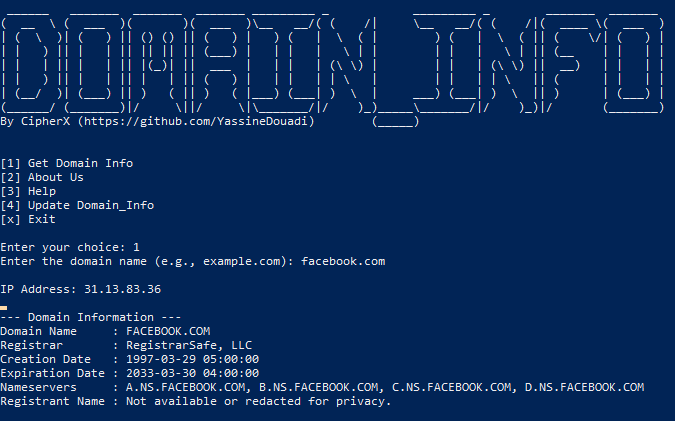

# Domain Info Script

A Python-based script that allows users to retrieve domain-related information, including IP address, WHOIS details, and more. The tool provides the following options for users:

1. **Domain Info**: Retrieves IP address and WHOIS details for a specified domain.
2. **About Us**: Information about the script and its creator.
3. **Help**: Displays instructions on how to use the script.
4. **Update Domain Info**: A feature that will allow future updates to the domain information tool (currently under development).

## Features

- Get domain information such as IP address, registrar, creation and expiration date, and nameservers.
- View details about the script and its creator.
- Get a help menu to understand how to use the script.

## Requirements

- Python 3.x
- `socket` module (built-in)
- `whois` module (install via `pip install python-whois`)

## Installation

1. Clone the repository:

    ```bash
    git clone https://github.com/CipherX-bit/Domain_Info.git
    ```

2. Install dependencies:

    ```bash
    pip install python-whois
    ```

## Usage

1. Run the script:

    ```bash
    python domain_info.py
    ```

2. You'll be prompted with the following options:

    - **[1] Domain Info**: Enter the domain name (e.g., `example.com`) to retrieve IP and WHOIS details.
    - **[2] About Us**: Learn more about the script and its creator.
    - **[3] Help**: View this help guide.
    - **[4] Update Domain Info**: This is a feature under development to update domain information.
    - **[x] Exit**: Exit the script.

## Screenshot

Here is a screenshot of the script in action:



## Contributing

Feel free to contribute to the project by opening issues or submitting pull requests on [GitHub](https://github.com/YassineDouadi/Domain_Info).

## License

This project is open source and available under the MIT License.
